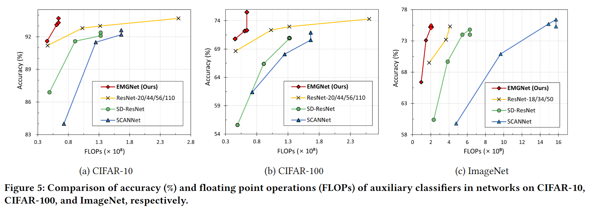

# CIKM'21 EMGNet: Efficient Multi-Scale Feature Generation AdaptiveNetwork
## Abstract

Recently, an early exit network, which dynamically adjusts the
model complexity during inference time, has achieved remarkable
performance and neural network efficiency to be used for various
applications. So far, many researchers have been focusing on reduc-
ing the redundancy of input sample or model architecture. However,
they were unsuccessful at resolving the performance drop of early
classifiers that make predictions with insufficient high-level feature
information. Consequently, the performance degradation of early
classifiers had a devastating effect on the entire network perfor-
mance sharing the backbone. Thus, in this paper, we propose an Effi-
cient Multi-Scale Feature Generation Adaptive Network (EMGNet),
which not only reduced the redundancy of the architecture but
also generates multi-scale features to improve the performance of
the early exit network. Our approach renders multi-scale feature
generation highly efficient through sharing weights in the center of
the convolution kernel. Also, our gating network effectively learns
to automatically determine the proper multi-scale feature ratio
required for each convolution layer in different locations of the
network. We demonstrate that our proposed model outperforms
the state-of-the-art adaptive networks on CIFAR10, CIFAR100, and
ImageNet datasets.

## Environments Settings

- #### CUDA version >= 11.1
- #### Pytorch version >= 1.8
- #### Ubuntu 18.04
- #### I trained the model using 4 Gpus (Rtx3090).

